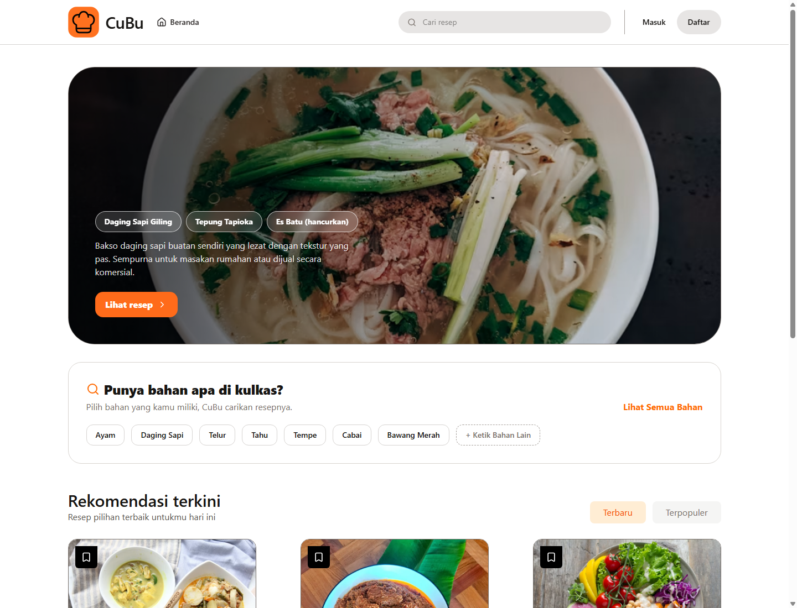

# CuBu - Cookbook Application

CuBu adalah aplikasi cookbook berbasis web dan mobile untuk membantu masyarakat Indonesia belajar memasak secara mandiri. Aplikasi ini menyediakan katalog resep lokal, panduan bahan dan langkah memasak, koleksi resep pribadi, video kelas memasak dari creator terverifikasi, serta fitur konsultasi memasak berbasis AI.

Proyek ini dikembangkan sebagai Team Based Project mata kuliah Rekayasa Perangkat Lunak, Program Studi Informatika, Fakultas Teknologi Informasi dan Sains Data, Universitas Sebelas Maret.

## Anggota Kelompok

| NIM | Nama | Role |
|---|---|---|
| L0124143 | Syafiq Nafil Arkan | Anggota Tim |
| L0124144 | Wantech Arofiq Huda Firdausyi | Anggota Tim |
| L0124152 | Naufal Farrell Budianto | Anggota Tim |
| L0124153 | Odyssey Wibi Pradana | Anggota Tim |

## Fitur Utama

- Registrasi, login, logout, dan pengelolaan sesi pengguna.
- Katalog resep publik dengan detail alat, bahan, estimasi waktu, tingkat kesulitan, dan langkah memasak.
- Pencarian resep berdasarkan nama resep atau bahan.
- Publikasi, pembaruan, dan penghapusan resep oleh pengguna yang berwenang.
- Koleksi resep pribadi untuk menyimpan dan menghapus resep favorit.
- Upload dan akses video kelas memasak untuk creator terverifikasi.
- Pengajuan dan verifikasi creator oleh admin.
- Dashboard admin untuk moderasi pengguna, resep, pengajuan creator, dan pengaturan AI.
- Review atau penilaian resep oleh pengguna terautentikasi.
- Konsultasi memasak berbasis AI untuk pertanyaan seputar resep dan teknik memasak.
- Aplikasi mobile Android sebagai klien pendukung Cookbook.

## Screenshot



## Tech Stack

### Web

| Layer | Teknologi |
|---|---|
| Backend | PHP 8.3+, Laravel 13 |
| Frontend | React 19, Vite 8, Tailwind CSS 4 |
| Database | MySQL/MariaDB |
| Authentication | Laravel session authentication |
| Testing | PHPUnit, Vitest |
| AI Integration | Gemini API |

### Mobile

| Layer | Teknologi |
|---|---|
| Platform | Android |
| Bahasa | Kotlin |
| UI | Jetpack Compose, Material 3 |
| Network | Retrofit, Gson |
| Image Loading | Coil |

## Struktur Folder

```text
.
|-- docs/                         # Dokumen proyek, UML, wireframe, screenshot, AI log
|-- src/                          # Aplikasi web Laravel + React
|   |-- app/                      # Controller, model, service, middleware
|   |-- database/                 # Migration dan seeder
|   |-- resources/                # Frontend React dan view
|   |-- routes/                   # Route web dan API
|   `-- tests/                    # Test backend
|-- src-mobile/
|   `-- CookbookFinalProject/     # Aplikasi mobile Android
`-- README.md
```

## Prasyarat

Pastikan perangkat sudah memiliki:

- PHP 8.3 atau lebih baru.
- Composer.
- Node.js dan npm.
- MySQL atau MariaDB, misalnya melalui XAMPP.
- Git.
- Android Studio jika ingin menjalankan aplikasi mobile.

## Instalasi dan Menjalankan Aplikasi Web

Masuk ke folder aplikasi web:

```powershell
cd D:\praktikum-rpl-b-05\src
```

Install dependency backend dan frontend:

```powershell
composer install
npm install
```

Buat database MySQL, misalnya:

```sql
CREATE DATABASE cubu;
```

Buat file `.env` di folder `src`. Jangan commit file `.env` ke GitHub karena berisi konfigurasi lokal dan credential.

Contoh konfigurasi minimal:

```env
APP_NAME=CuBu
APP_ENV=local
APP_KEY=
APP_DEBUG=true
APP_URL=http://localhost:8000

DB_CONNECTION=mysql
DB_HOST=127.0.0.1
DB_PORT=3306
DB_DATABASE=cubu
DB_USERNAME=root
DB_PASSWORD=

SESSION_DRIVER=database
CACHE_STORE=database
QUEUE_CONNECTION=database
FILESYSTEM_DISK=public

GEMINI_API_KEY=
GEMINI_BASE_URL=https://generativelanguage.googleapis.com/v1beta
GEMINI_MODEL=gemini-2.5-flash-lite
```

Generate application key:

```powershell
php artisan key:generate
```

Jalankan migration dan seeder:

```powershell
php artisan migrate:fresh --seed
```

Buat storage link:

```powershell
php artisan storage:link
```

Jalankan aplikasi:

```powershell
composer dev
```

Buka aplikasi melalui browser:

```text
http://localhost:8000
```

## Akun Demo

Seeder menyediakan akun berikut untuk pengujian lokal:

| Role | Email | Password |
|---|---|---|
| Admin | admin@cubu.test | password123 |
| User | dummy@example.com | password123 |
| Creator | chef@example.com | password123 |

## Menjalankan Test

Backend unit test:

```powershell
cd D:\praktikum-rpl-b-05\src
.\vendor\bin\phpunit.bat --bootstrap vendor\autoload.php tests\Unit
```

Frontend test:

```powershell
cd D:\praktikum-rpl-b-05\src
npm run test:frontend
```

Build frontend:

```powershell
cd D:\praktikum-rpl-b-05\src
npm run build
```

## Menjalankan Aplikasi Mobile

1. Buka Android Studio.
2. Pilih folder:

```text
D:\praktikum-rpl-b-05\src-mobile\CookbookFinalProject
```

3. Tunggu Gradle sync selesai.
4. Pastikan laptop terhubung ke internet saat Gradle sync karena Android Studio perlu mengunduh library.
5. Jalankan aplikasi ke emulator atau perangkat Android.

### Konfigurasi Koneksi API Android

Aplikasi mobile mengambil data dari backend Laravel. Karena itu, alamat backend pada file `RetrofitClient.kt` harus disesuaikan dengan alamat IP perangkat yang menjalankan Laravel.

File yang perlu diubah:

```text
src-mobile\CookbookFinalProject\app\src\main\java\com\example\cookbookfinalproject\data\api\RetrofitClient.kt
```

Jika backend Laravel dijalankan di laptop sendiri:

1. Buka CMD atau PowerShell.
2. Jalankan perintah berikut untuk melihat alamat IP:

```powershell
ipconfig
```

3. Cari bagian WiFi atau hotspot yang sedang digunakan, lalu catat nilai `IPv4 Address`, misalnya `192.168.100.12`.
4. Jalankan Laravel dengan host `0.0.0.0` agar dapat diakses dari perangkat lain:

```powershell
cd D:\praktikum-rpl-b-05\src
php artisan serve --host=0.0.0.0 --port=8000
```

5. Ubah `BASE_URL` di `RetrofitClient.kt` sesuai IP tersebut:

```kotlin
private const val BASE_URL = "http://192.168.100.12:8000/"
```

Jika menggunakan backend dari laptop teman, pastikan perangkat Android dan laptop teman berada pada jaringan WiFi atau hotspot yang sama, lalu gunakan IPv4 Address laptop teman tersebut pada `BASE_URL`.

Jika menggunakan emulator Android dan backend Laravel berjalan di laptop yang sama, gunakan alamat berikut:

```kotlin
private const val BASE_URL = "http://10.0.2.2:8000/"
```

### Run Aplikasi Android

1. Hubungkan HP Android dengan kabel USB dan aktifkan Developer Options serta USB Debugging, atau gunakan emulator Android Studio.
2. Klik tombol Run berwarna hijau di Android Studio.
3. Tunggu proses build selesai.

Build debug APK melalui terminal:

```powershell
cd "D:\praktikum-rpl-b-05\src-mobile\CookbookFinalProject"
.\gradlew.bat assembleDebug
```

### Troubleshooting Mobile

Jika data tidak muncul, loading terus, atau terjadi timeout:

- Pastikan Laravel berjalan dengan `--host=0.0.0.0 --port=8000`.
- Pastikan `BASE_URL` di `RetrofitClient.kt` memakai IP yang benar dan diakhiri `/`.
- Pastikan HP dan laptop berada pada jaringan WiFi atau hotspot yang sama.
- Coba akses `http://IP-LAPTOP:8000` dari browser HP untuk memastikan backend dapat dijangkau.
- Jika Windows Defender Firewall memblokir koneksi, izinkan akses untuk PHP/Laravel pada jaringan private. Jika perlu mematikan firewall sementara untuk pengujian, aktifkan kembali setelah selesai.

## Catatan Responsible AI Use

Proyek ini dapat menggunakan bantuan AI untuk eksplorasi ide, dokumentasi, debugging, dan pembuatan test. Seluruh penggunaan AI yang signifikan dicatat pada:

```text
docs/ai-usage-log.md
```

Tim wajib memverifikasi seluruh output AI, tidak memasukkan credential atau data sensitif ke prompt, dan memahami perubahan sebelum digabungkan ke repositori.

## Lisensi

Proyek ini disusun untuk kebutuhan akademik mata kuliah Rekayasa Perangkat Lunak UNS Tahun Akademik 2025/2026.
